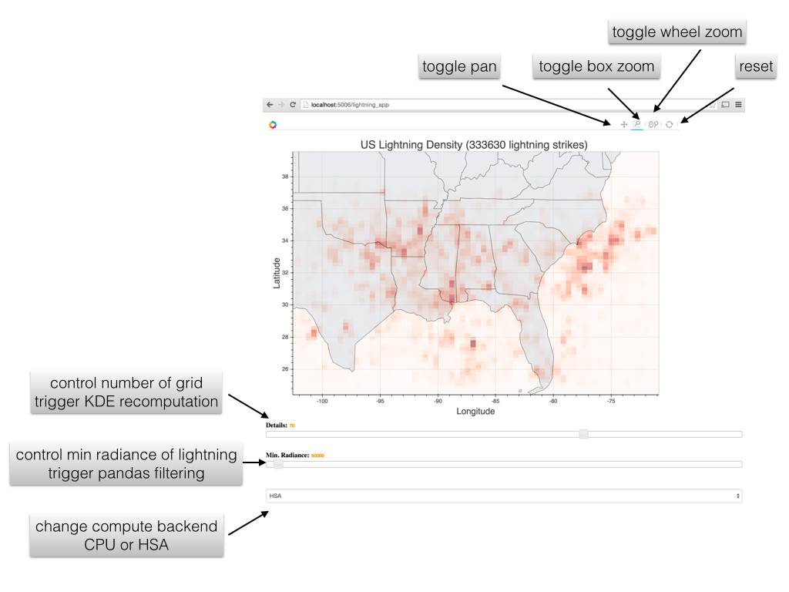

ROC Accelerated Kernel Density Estimation
=========================================

This example uses bokeh to setup an interactive plot of the density of US
lightning data.  This example uses the ROC-accelerated kernel density
estimation (KDE) code in "numba_roc_examples/kerneldensity" and the ROC pandas
eval/query backend in "numba_roc_examples/pandas_eval".

To start the bokeh app server, run the following from the root of the source
tree:

```bash
PYTHONPATH=`pwd` bokeh serve numba_roc_examples/kde_bokeh/lightning_app.py
```

This starts a bokeh server at port 5006.  Connect to the server with
http://localhost:5006/lightning_app

Here's a screenshot with annotation:



The map plot is interactive.  User can use the pan, box-zoom, and wheel-zoom
tools to control the viewport.  Changes to the viewport will trigger a
recomputation of the KDE to reflect only the visible data.

Below the map, there are two sliders.  The first slider controls the detail
level of the plot.  Increasing this value will increase the number of grid.
As a result, the grid division is finer.  The KDE is recomputed when this slider
is changed.  The second slider controls the minimum radiance of the lightning
to show.  Internally, a pandas `DataFrame.query` with configurable backends
(CPU or ROC) is used to filter the dataset.

Lastly, the dropbox at the bottom allows the user to change the compute backend
of the KDE and pandas query.  The default value is the CPU.  User can change
it to ROC to leverage the GPU for faster updating to the plot.
